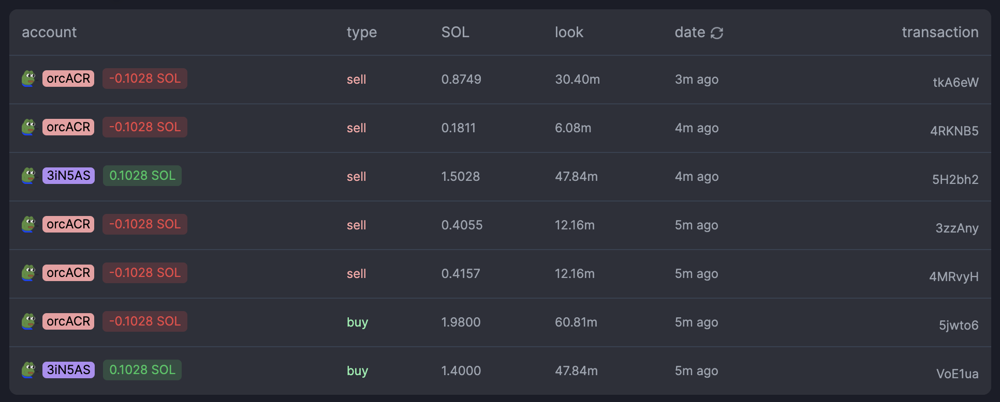

### git clone this repositery and install from chrome extension page.
### then open the example url: [https://pump.fun/22WKnJdDFZxPuwpFZMQUbrs9E3Vc5nHTh1pDPunHL19t](https://pump.fun/22WKnJdDFZxPuwpFZMQUbrs9E3Vc5nHTh1pDPunHL19t)
### 
### enjoy it!